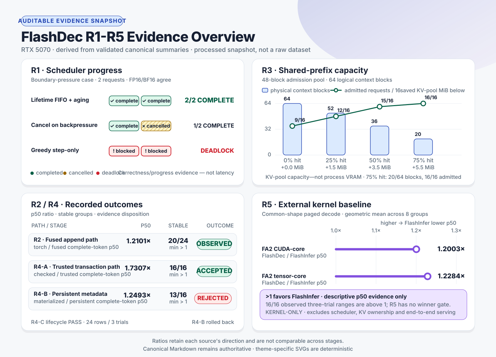

<div align="center">

# ⚡ FlashDec

**从 PagedAttention kernel 到可验证的单 GPU LLM decode runtime**

*A correctness-first decode runtime built with PyTorch, Triton and CUDA.*

[](https://github.com/cysong2025/flashdec/actions/workflows/quality.yml)


[](LICENSE)

</div>

FlashDec 用一条可审计的数据路径研究单 token decode：请求如何拥有 paged KV block，调度器如何在容量压力下保证进展，多层 K/V 写入如何原子提交，以及 kernel 优化能否穿过 runtime 开销形成完整 step 收益。

核心 runtime 面向单 GPU、caller-provided Q/K/V，不自行实现完整模型或 serving 服务。可选的 vLLM out-of-tree backend 把 eligible single-token decode 接入真实 Qwen2.5-3B；模型、prefill、调度、sampling 与 HTTP server 仍由 vLLM 拥有。PyTorch reference 定义数值语义；PagedKVCache 独占 block、`seq_len` 与事务状态；Triton/CUDA 负责受这些状态约束的数据路径。

## 研究问题

| 问题 | FlashDec 的回答 | 主要证据 |
| --- | --- | --- |
| logical token 如何映射到非连续 physical KV blocks？ | 独立 dense/paged reference、token-major cache、显式 block table 与 masked online softmax | [warp selection](benchmarks/results/paged_decode_warp_selection_summary.md) · [block-size](benchmarks/results/paged_decode_block_size_summary.md) · [layout](benchmarks/results/paged_decode_kv_layout_summary.md) · [default profile](benchmarks/results/paged_decode_default_profile_summary.md) |
| 谁拥有 block、`seq_len` 和 request lifecycle？ | PagedKVCache 是唯一权威状态源；kernel 和 benchmark 不推进 lifecycle | [Paged KV 设计](docs/design_paged_kv.md) · [DecodeEngine 设计](docs/design_decode_engine.md) |
| KV 容量不足时如何避免 boundary deadlock 与 starvation？ | lifetime block commitment、FIFO + aging、公平 runnable subset、policy/snapshot-bound decision | [scheduler matrix](benchmarks/results/scheduler_capacity_progress_summary.md) |
| 多层 token 如何只提交一次并支持整体回滚？ | 所有 layer 共享预留位置，按序写入，batch 原子 commit/abort，终态元数据有界回收 | [multi-layer matrix](benchmarks/results/multi_layer_transaction_summary.md) · [transaction design](docs/design_multi_layer_kv_transaction.md) |
| shared prefix 的收益究竟来自哪里？ | 只共享 immutable full blocks，以 refcount/LRU 管理；容量与 admission 收益和 latency 分开报告 | [8-trial confirmation](benchmarks/results/shared_prefix_capacity_summary.md) |
| kernel 优化如何传播到系统，又如何公平比较外部实现？ | 分离 append-only、complete-step、profiler、外部 kernel、真实模型与在线 serving；保留未过门槛结果 | [性能报告](docs/performance_report.md) · [FlashInfer baseline](benchmarks/results/flashinfer_paged_decode_baseline_summary.md) · [vLLM Qwen kernel](benchmarks/results/vllm_qwen_attention_summary.md) |

完整的问题定义、假设和证据链见[研究问题](docs/research_questions.md)。

## 架构

<p align="center">
  <picture>
    <source media="(prefers-color-scheme: dark)" srcset="docs/assets/flashdec-architecture-dark.svg">
    <source media="(prefers-color-scheme: light)" srcset="docs/assets/flashdec-architecture-light.svg">
    
  </picture>
</p>

```text
RequestSpec / caller-provided Q,K,V
                 │
                 ▼
       Block-aware Scheduler
                 │ policy + snapshot-bound decision
                 ▼
            DecodeEngine
                 │ token transaction
                 ▼
          PagedKVCache runtime
       ownership / refcount / rollback
                 │
       ┌─────────┴─────────┐
       ▼                   ▼
Fused RoPE + KV append   Triton paged decode
       └─────────┬─────────┘
                 ▼
      correctness + benchmark evidence
```

Scheduler 产生携带原始 K/V-free metadata snapshot 与 config 的容量决策；DecodeEngine 从权威状态重建 snapshot、按 config 重跑 canonical policy 后再编排执行；PagedKVCache 管理 ownership、事务、`seq_len` 和 shared-prefix lifetime。完整不变量见[总体设计](docs/design.md)。

可选 vLLM integration 位于核心 runtime 边界之外：vLLM 提供真实模型、prefill、KV allocation、scheduler 和 API server，FlashDec 只替换满足严格条件的 decode attention；不支持的调用自动回退原生 Triton backend。详见 [vLLM backend 设计](docs/design_vllm_backend.md)。

## 主要发现

<p align="center">
  <a href="docs/assets/flashdec-results-overview-light.svg">
    <picture>
      <source media="(prefers-color-scheme: dark)" srcset="docs/assets/flashdec-results-overview-dark.svg">
      <source media="(prefers-color-scheme: light)" srcset="docs/assets/flashdec-results-overview-light.svg">
      
    </picture>
  </a>
</p>

- Scheduler 的主要价值是容量安全和进展保证：boundary case 中 lifetime policy 完成率为 `100%`，cancel baseline 为 `50%`，greedy baseline 为 `0%`。
- 75% shared-prefix hit 将 context physical blocks 从 `64/64` 降至 `20/64`，节省 `68.8%`（`5.5 MiB`）容量，并把固定池 admission 从 `9/16` 提高到 `16/16`；latency 没有稳定方向。
- Cache-owned trusted transaction 移除了每 layer 的重复 device reduction 与 host scalar sync；persistent-metadata 候选仅 `13/16` 组稳定，未采用。
- 固定 FlashInfer `0.6.15.post1` 的共同 paged-decode kernel 对比中，FlashDec/FlashInfer p50 latency ratio 为 `1.2003x`（CUDA core）和 `1.2284x`（tensor core）；比值大于 1 表示 FlashInfer 更低延迟。该结论不外推到完整 runtime。
- 固定 vLLM `0.25.1` 与 Qwen2.5-3B BF16 shape 的外部 kernel gate 中，FlashDec 在 B8/ctx1024 和 B8/ctx2048 的 p50 分别为 vLLM Triton 的 `0.8025x` 和 `0.7926x`，即降低 `19.75%` 和 `20.74%`；B1/B4 guardrail 全部通过。
- 真实 Qwen evidence 保留 Amdahl 边界：固定批量模型 p50 只改善 `0.16%–0.41%`，未达到预注册模型目标；在线 median/p90 TPOT 分别改善约 `0.31%/0.27%`，但 throughput 中位数 `1.0019x` 略低于 `1.002x` 门槛，因此整体 serving gate 为 `FAIL`。不能把约 20% kernel 收益写成约 20% serving 加速。
- 外部基线证据提交 `d7d4feb` 的 GPU full regression 为 `453 passed, 94 subtests passed`；GitHub Actions 运行不依赖 GPU 的仓库检查子集。测试计数绑定具体 commit 和环境，不作为滚动徽章。
- R6-A hardening 提交 `87d8a34` 在同一 RTX 5070/CUDA 12.8 开发环境完成当前代码回归：focused 为 `254 passed, 20 subtests passed`，full 为 `501 passed, 100 subtests passed`，clean-tree public release check 为 `PASS`。这组结果验证事务回收与 scheduler decision 边界，不替代绑定历史提交的性能矩阵。
- R7 证据提交 `61836b6` 的 vLLM/cu130 专项为 `21 passed`；cu128 全仓库为 `531 passed, 1 skipped, 100 subtests passed`，唯一 skip 是 cu128 环境未安装 vLLM。两套环境 `pip check` 与 clean-tree public release gate 均为 `PASS`。测试计数只证明对应提交的 correctness，不改变上述性能门槛结果。

图中数据由受版本控制的 Markdown summaries 派生。来源、trial 范围、ratio 方向和负结果见[结果索引](benchmarks/results/README.md)与[数据快照](benchmarks/results/public_results_snapshot.json)。

## 快速开始

推荐 Linux/WSL 与 Python 3.10+。CUDA extension 需要与 PyTorch CUDA build 匹配的 Toolkit、NVCC 和 Ninja。

```bash
git clone https://github.com/cysong2025/flashdec.git
cd flashdec

python3 -m venv .venv
source .venv/bin/activate
python -m pip install --upgrade pip setuptools wheel
python -m pip install -e ".[dev,cuda-extension]"

python scripts/check_env.py
python -m pytest -q -ra
```

这条开发安装路径只适用于满足支持矩阵的环境，不构成对任意 Python/CUDA 组合的兼容性保证。请先核对 Python、PyTorch CUDA build、Toolkit/NVCC 与 GPU 架构；已验证组合和分层命令见[兼容性说明](docs/compatibility.md)与[复现指南](docs/reproducibility.md)。FlashInfer 对比必须使用独立环境和 [`constraints/flashinfer-cu128.txt`](constraints/flashinfer-cu128.txt)。

vLLM integration 使用固定的 `vLLM==0.25.1` 环境。为避免解析器替换既有 Torch/CUDA stack，推荐先准备兼容的 vLLM 环境，再用 `python -m pip install --no-deps -e .` 安装 FlashDec；完整 Qwen 命令与 WSL 环境变量见[复现指南](docs/reproducibility.md#vllm-qwen25-3b-外部比较)。

无需 GPU 的仓库检查：

```bash
python scripts/check_docs.py
python scripts/check_release.py --require-evidence --require-public
python -m compileall -q flashdec tests benchmarks scripts
```

## API 速览

Paged decode：

```python
import flashdec

head_dim = q.shape[-1]
out = flashdec.decode(
    q,
    k_cache,
    v_cache,
    block_tables,
    seq_lens,
    sm_scale=head_dim**-0.5,
    block_size=32,
)
```

Multi-layer token transaction：

```python
tx = engine.begin_step(request_ids)
for layer_idx, (q, k, v) in enumerate(zip(q_by_layer, k_by_layer, v_by_layer)):
    engine.step_layer(tx, layer_idx, q, k, v)
result = engine.commit_step(tx)
```

任一 `step_layer()` 失败都会 abort 整个 token；调用方必须丢弃此前 layer outputs。接口契约见[API 文档](docs/API.md)。

## 仓库结构

| 路径 | 内容 |
| --- | --- |
| [`flashdec/`](flashdec) | Paged KV runtime、scheduler、DecodeEngine 与 Triton/CUDA data path |
| [`tests/`](tests) | reference、状态机、kernel、失败路径与证据校验 |
| [`benchmarks/`](benchmarks) | benchmark runners、profilers 和 strict summarizers |
| [`benchmarks/results/`](benchmarks/results) | 审核后提交的正式 Markdown 证据；原始 CSV/log 不进入 Git |
| [`docs/`](docs) | 研究问题、设计、兼容性、性能方法和复现说明 |
| [`scripts/`](scripts) | 环境、文档、证据与仓库一致性检查 |

推荐阅读顺序：

1. [研究问题](docs/research_questions.md)
2. [总体设计](docs/design.md)
3. [API 文档](docs/API.md)
4. [性能报告](docs/performance_report.md)
5. [结果索引](benchmarks/results/README.md)
6. [复现指南](docs/reproducibility.md)

完整导航见[文档索引](docs/INDEX.md)。

## 范围边界

FlashDec 包含单 GPU single-token decode、FP16/BF16、MHA/GQA/MQA、caller-provided Q/K/V、transactional context import 和 caller-built immutable shared-prefix blocks。

FlashDec 核心不包含完整 Transformer/prefill forward、tokenizer、sampling、HTTP/RPC serving、生产级 continuous batching、TP/PP、多机、swap/offload 或自动 prefix content hashing。可选 vLLM plugin 复用这些外部能力，但不把它们变成 FlashDec 自有实现。不同 shape、layout、scheduler 或计时边界的结果不能直接解释为工业 serving 系统的 speedup。

贡献前请阅读[贡献指南](CONTRIBUTING.md)与[行为准则](CODE_OF_CONDUCT.md)；使用问题见[支持说明](SUPPORT.md)，安全问题见[安全政策](SECURITY.md)，引用信息见[`CITATION.cff`](CITATION.cff)。

## License

FlashDec 采用 [Apache License 2.0](LICENSE) 开源。
