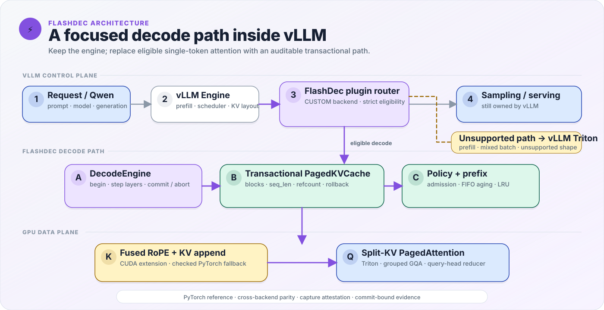

# FlashDec 总体设计

本文描述 FlashDec 的稳定架构、核心语义和模块边界。各子系统的状态机、失败路径与实验协议见[文档索引](INDEX.md)中的专题设计。

## 1. 设计目标

FlashDec 研究单 GPU LLM decode 中三个相互关联的问题：

1. 变长请求如何通过 paged KV blocks 保存历史 K/V。
2. scheduler、allocator 和执行引擎如何在动态 batch 下保持所有权与进展。
3. CUDA/Triton 优化是否能从单算子传递到完整 token transaction。

项目不执行完整 Transformer forward。Q/K/V 由调用方提供，输出停在 attention；tokenizer、sampling、网络服务和多 GPU 并行不在范围内。

## 2. 分层架构

<p align="center">
  <picture>
    <source media="(prefers-color-scheme: dark)" srcset="assets/flashdec-architecture-dark.svg">
    <source media="(prefers-color-scheme: light)" srcset="assets/flashdec-architecture-light.svg">
    
  </picture>
</p>

单次 token transaction 的数据路径是：DecodeEngine 把当前层 Q/K/V 和 Cache 预留的位置交给 fused RoPE + KV append；append 返回 rotated Q 并把 rotated K 与 V 写入 Cache；paged decode attention 使用 rotated Q，以及 Cache 提供的 paged K/V、block tables 和 effective seq_lens。Attention 输出回到 DecodeEngine 后才能继续下一层或提交事务。

所有权规则：

- Scheduler 只产生 decision，不直接修改 Cache。
- DecodeEngine 校验 decision 并组织一次或多层 token 执行。
- PagedKVCache 是 block ownership、request lifecycle 和 seq_len 的唯一事实来源。
- Kernel 只消费 tensor 和位置，不维护 request 状态。
- Benchmark 通过公开 runtime API 执行，不复制 allocator 或事务语义。

## 3. Decode Attention 语义

单个 decode step 的输入输出约定：

```text
q:        [num_seqs, num_q_heads, head_dim]
k_cache:  dense 或 paged physical storage
v_cache:  dense 或 paged physical storage
seq_lens: [num_seqs]
out:      [num_seqs, num_q_heads, head_dim]
```

每个 query head 通过以下映射选择 KV head：

```python
kv_head = q_head // (num_q_heads // num_kv_heads)
```

因此同一语义同时覆盖 MHA、GQA 和 MQA。Attention 只读取 `[0, seq_len)` 的有效历史，并使用 FP32 accumulation 与数值稳定 softmax。`dense_decode_attention_ref` 和 `paged_decode_attention_ref` 是 Triton 实现的 correctness anchor。

## 4. Paged KV 语义

逻辑 token 位置通过 block table 映射到 physical storage：

```text
logical_block = position // block_size
block_offset  = position % block_size
physical_id   = block_table[request, logical_block]
```

默认 token-major physical storage layout 为：

```text
[num_layers, num_blocks, num_kv_heads, block_size, head_dim]
```

去掉 layer 维度后，paged attention kernel 接收 `[num_blocks, num_kv_heads, block_size, head_dim]`；其中 token 轴位于 `head_dim` 之前。

Cache 负责容量预检、分配、释放、复用和终态 request 检查。批量操作在修改状态前完成 preflight；容量不足时不允许部分 request 或部分 seq_len 被提交。

## 5. Token Transaction

多层执行不能为每一层分别增长 request 长度。FlashDec 使用显式 token transaction：

```text
begin_step(request_ids)
    -> reserve one physical location per request
step_layer(layer=0 ... N-1)
    -> write K/V and run attention at the shared location
commit_step()
    -> advance each seq_len exactly once

exception
    -> rollback reservation and keep committed state unchanged
```

Open transaction 中的 layer 可以读取 `committed_seq_len + 1` 的有效视图，但未提交 bytes 对其他操作不可见。跨层 block id 与 offset 必须一致；中途失败后，调用方必须丢弃此前 layer output。

## 6. Scheduler 与 Backpressure

Scheduler 根据 logical capacity、physical free blocks、request lifetime commitment 和等待年龄选择 runnable subset。Decision 带有 `state_version`；Engine 在执行前拒绝 stale 或 forged decision。

容量不足是正常 backpressure，不是 Cache 异常。默认 lifetime FIFO + aging 策略优先保证：

- 不超额承诺 physical blocks。
- 有限请求在边界容量场景中取得进展。
- waiting request 不因持续新到达请求而永久饥饿。

R1 的 boundary workload 用 cancel 和 greedy baseline 展示了仅看当前 step 空间时可能出现的零进展问题；它不是无条件吞吐加速结论。

## 7. Kernel 与性能边界

Paged decode 默认配置冻结为 token-major、`block_size=32`、`num_warps=2`、`num_stages=None`。Fused CUDA 路径把 RoPE、位置映射和 K/V 写入放在更少的 launch 中；attention 仍由相同的 Triton paged decode kernel 完成。

因此性能证据分为三层：

- kernel/event time：解释设备端工作。
- profiler attribution：解释 append、decode 和 launch 数变化。
- non-instrumented complete-token wall latency：作为正式系统性能来源。

Profiler 数据不与 release latency 混用。所有性能结论绑定硬件、commit、seed、shape、trial 和 backend order，详见[性能报告](performance_report.md)与[复现指南](reproducibility.md)。

## 8. 公开边界

- 支持单 GPU、单 token decode 和顺序 multi-layer transaction。
- 支持 FP16/BF16 paged decode；append reference 另支持 FP32。
- 支持调用方预构建的 immutable full-block shared prefix；不包含 multi-layer prompt prefill、prefix 内容构建/hash、admission-time prefix eviction、抢占、swap/offload 或生产级并发服务。
- CUDA extension 使用 lazy JIT，首次运行含构建成本。
- 当前版本为 private `0.0.0` development candidate；clean-install、版本、公开与 tag gate 按所有者要求暂停。
