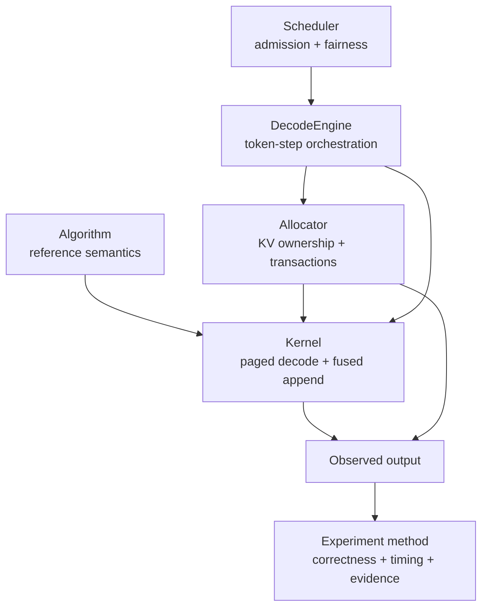
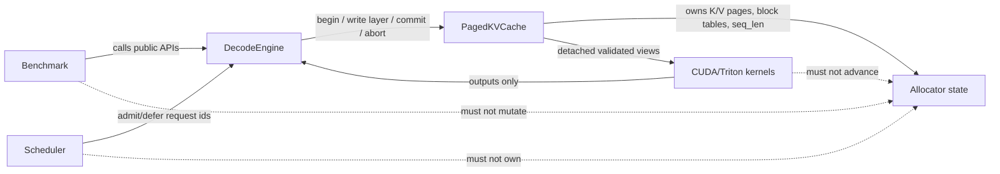
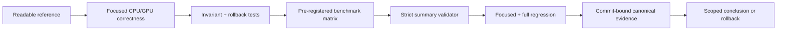

# 从 PagedAttention 到 Decode Runtime：FlashDec 的五层工程路径

## 背景

decode attention 表面上是一个算子，但动态 batch 中的真正问题是：历史 K/V 放在哪里，谁能修改它，容量不足时谁要等待，中途失败怎样撤销，以及一个 kernel 优化是否真的穿透到完整 token step。

FlashDec 把这些问题拆成五层：算法定义语义，kernel 完成 GPU 数据路径，allocator 维护 KV 所有权，scheduler 在容量约束下决定谁执行，实验方法负责判断前四层是否真的正确且有效。



## 第一层：算法语义

### Decode attention 不等于 prefill

decode 时每个 request 只有当前一个 query token，它需要读取该 request 的全部历史 K/V：

```text
scores = Q K^T * sm_scale
prob   = softmax(scores)
out    = prob V
```

PagedAttention 不改变这个数学定义，只把连续序列下标替换为：

```text
logical token
  -> logical block + offset
  -> block_table[logical block]
  -> physical block + offset
```

因此可读的 PyTorch reference 是项目的语义锚点。它不追求快，而是明确 mask、变长 context、MHA/GQA/MQA head mapping、dtype 和 `sm_scale`。kernel、runtime 或第三方基线只要输出超出预定容差，性能数字就失去意义。

### Online softmax 是分块的数值基础

Paged K/V 通常按 token block 扫描，不应先物化完整 score matrix。对每个分块维护运行最大值 `m`、归一化和 `l` 与加权累积 `acc`，新 block 到来时重标定旧累积。这既避免中间 tensor，也保留了减最大值的数值稳定性。

## 第二层：GPU kernel 与数据路径

### 先固定 layout，再谈 launch 配置

FlashDec 冻结的 token-major K/V page 布局是 `[page, kv_head, token, dim]`。这个布局让同一 head 的一个 token 向量在 `head_dim` 上连续，也与 R5 FlashInfer `HND` 公开接口的逻辑顺序直接对应。

Triton kernel 根据 program id 定位 request 与 query head，用 block table 找到 physical page，对 context 尾部做 mask，并用 online softmax 累积输出。调优不是不断增加参数：`block_size`、`num_warps` 与 staging 都要经过完整 shape 矩阵和负结果后才能成为默认值。

### 优化要追到完整 token path

decode step 不只有 attention，还包含 RoPE、K/V append、索引校验与 host dispatch。FlashDec 用 fused RoPE + paged KV append 减少中间数据路径，又用 Cache-owned trusted transaction 避免每层重复做 allocator 已经证明的 device-value reduction 和 host sync。

这里的安全边界很重要：对外 public raw primitive 仍然完整检查任意输入；只有 allocator 自己创建、且处于 open transaction 中的位置才能走 trusted path。性能优化不能通过拆掉公开 API 安全性换取。

## 第三层：Paged KV allocator

### Physical block 是一等运行时资源

allocator 维护 free list、request 的 logical-to-physical block table、`seq_len` 与 K/V tensor。新 token 落在既有 block 内时只增长尾部；跨过 block boundary 时才分配新 physical block。finish/cancel 必须释放 private blocks，之后的 request 能够重用它们。

multi-layer decode 进一步要求 token transaction：一个 token 只保留一次 block id/offset，所有 layer 写同一个逻辑位置，全部成功后 `seq_len` 只推进一次。任一 layer 失败必须 abort，撤销 pending state 和 boundary allocation，不允许部分 layer 可见。

### Shared prefix 改变所有权，不改变 attention 算法

已注册的 full-block prefix 是 immutable shared residency。请求 attach 时增加 active refcount，只为 private tail 保留新 block；detach 时释放 private tail 并降低 refcount。这会改变容量和 admission，但 attention 仍然读取相同的 token 序列，不应因此预设 kernel latency 一定改善。

## KV ownership：谁决定，谁拥有，谁只读



这张图表达了三个不变量：

1. Scheduler 只基于 snapshot 决定 request ids，不持有 K/V tensor 或 physical blocks。
2. PagedKVCache 是 block ownership、transaction 和 `seq_len` 的唯一权威来源。
3. Kernel 只消费已校验 view 并产生输出，不推进 request lifecycle；benchmark 也不能为方便构造数据而绕过 allocator。

## 第四层：Block-aware scheduler

### Admission 要为未来负责

只检查“下一个 token 是否有 block”会让系统在 boundary 上互相占住容量。FlashDec scheduler 对每个 active request 做 lifetime block commitment，并为运行时保留 reserve blocks。Shared prefix residency 与 request-private commitment 分开计算，避免把同一 immutable prefix 对每个 hit request 重复计费。

### 容量安全不等于公平

Scheduler 用 FIFO + aging 限制大 request 被小 request 长期绕过。decision 绑定 Cache/Engine snapshot version；如果 admission 后状态已变，Engine 拒绝 stale decision，而不是在旧容量事实上继续执行。

DecodeEngine 把这些决策转换成稳定 row mapping 和 token transaction：

```text
arrivals -> scheduler snapshot/decision -> admit/defer
         -> begin_step -> layer writes/decode -> commit or abort
         -> finish/cancel -> block reuse
```

这一层的核心价值是容量安全、进展与失败原子性，不是声称每个普通 workload 都有更低 latency。

## 第五层：实验方法与证据链

### 先问“测的是什么”

FlashDec 把性能边界分成不同层次：

- kernel-only：只计 CUDA work，用于 layout、launch 与公开 kernel 基线。
- append-only：评估 RoPE/KV append 及 fusion，不冒充完整 decode step。
- complete token：包含 allocator/Engine dispatch 与 attention，用来判断底层改动是否穿透。
- integrated workload：包含动态到达、admission、rollback、finish/cancel 与 reuse，主要验收 trajectory 而非单一 kernel speedup。

不同边界的数字不直接相除。profiler 用于归因，正式 latency 使用 non-instrumented CUDA event 或明确同步的 wall time。p50 描述典型路径，p90/p99 必须结合 repeat 数和 trace 长度解读；小样本 p99 不是生产尾延迟证据。

### 正结果和负结果使用同一验收门

每个实验先固定 commit、seed、shape、dtype、warmup/repeat/trial 和计时边界，再运行。strict summarizer 检查矩阵完整性、配对关系、correctness 和 metadata，不允许在看到结果后删除慢 row 或改动门槛。未达 keep gate 的 candidate 保留为正式负结果并回滚，它与成功优化同样是项目证据。



## R5 公开基线如何接入证据链

R5 使用固定的 `flashinfer-python==0.6.15.post1` 和官方 `BatchDecodeWithPagedKVCacheWrapper`。FlashDec Triton、FlashInfer FA2 与 FlashInfer FA2 Tensor Cores 三条路径共用 Q/K/V、page table、`seq_lens` 和 `sm_scale`，并分别与 PyTorch reference 对齐。

这个基线只计 `run`/kernel dispatch 的 CUDA-event 时间，排除 plan、JIT、input construction、layout metadata 适配和 reference validation。因此它能回答“共同 paged decode shape 下的 kernel 表现如何”，但不能回答“哪个 runtime 端到端更快”。FlashDec 的 allocator、scheduler、transaction 和 lifecycle 能力由它们自己的组合 workload 证据支撑，不会被第三方 kernel-only 数字代替。

预注册的 R5 正式矩阵覆盖四个 shape、FP16/BF16、三个 backend 与三轮 trial。当前 RTX 5070 正式结果仍待验证，因此本文只记录设计与方法，不预写性能排名。

## 总结

PagedAttention kernel 是 decode runtime 的必要组件，但不是全部。一个可解释的 runtime 需要同时回答五个问题：

1. 算法语义是否有独立 reference；
2. kernel 是否在明确 layout 和计时边界下正确执行；
3. allocator 是否对 block ownership、transaction 和 rollback 负责；
4. scheduler 是否在有限容量下提供安全与进展；
5. 实验是否能从输入、commit 和原始 CSV 一直追溯到范围受限的结论。

当这五层由同一组所有权不变量和证据门连接起来时，项目才从“一个能跑的 attention kernel”变成“一个能说清正确性、资源与性能边界的 decode runtime”。
