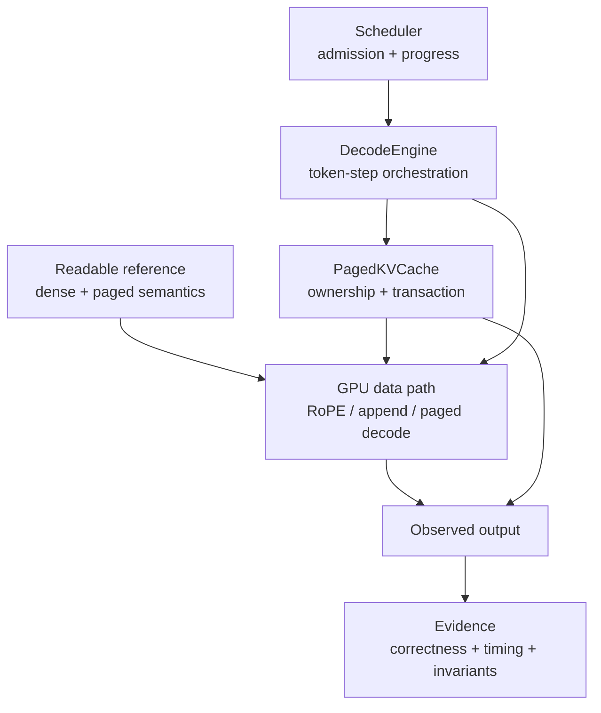
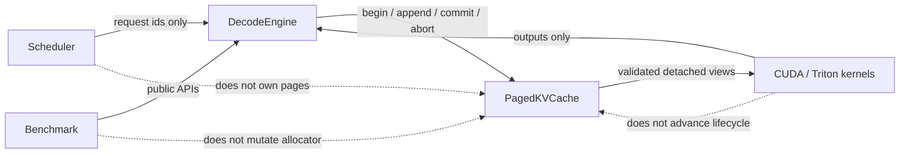

# FlashDec 研究问题

FlashDec 研究的不是一个孤立的 PagedAttention kernel，而是单 GPU、single-token decode 中相互依赖的语义、内存和执行问题：历史 K/V 如何寻址，谁拥有 physical blocks，容量不足时谁等待，多层写入失败后怎样回滚，以及 kernel 优化能否穿透到完整 token step。

本文按六个可检验的问题组织项目。每个问题都区分语义风险、实现回答、正式证据和结论边界；性能数字只在其记录的设备、shape、版本与计时范围内成立。



## 1. Paged decode 如何保持可独立验证的数学语义？

### 语义风险

PagedAttention 只应改变 K/V 的寻址方式，不能改变 attention 数学。若 reference、kernel 和 benchmark 分别解释 `seq_lens`、padding、GQA/MQA head mapping 或 page table，数值相近也可能是在比较不同问题。空 context、尾页 mask 和越界 physical page 尤其容易隐藏错误。

logical token 的地址转换是：

```text
logical token
  -> logical block + offset
  -> block_table[logical block]
  -> physical block + offset
```

### 实现回答

- [`dense_decode_attention_ref`](../flashdec/reference.py) 定义连续 K/V 下的可读语义。
- [`paged_decode_attention_ref`](../flashdec/paged_reference.py) 在相同 Q/K/V 数学上显式执行 logical-to-physical 映射。
- Triton dense/paged kernels 使用 FP32 score 与累积，并以 [online softmax](concepts/online_softmax.md) 分块扫描 context，不物化完整 score matrix。
- `seq_len == 0` 的输出定义为零；MHA、GQA、MQA 共享同一 query-head 到 KV-head 映射规则。
- 默认 paged layout 为 token-major `[page, kv_head, token, dim]`；layout、block size、warps 和 staging 都通过独立 sweep 决定，而不是写死后只验证单一 shape。

详细语义见[总体设计](design.md)和[Paged KV 设计](design_paged_kv.md)。

### 正式证据

- [Paged decode block-size matrix](../benchmarks/results/paged_decode_block_size_summary.md)
- [KV layout matrix](../benchmarks/results/paged_decode_kv_layout_summary.md)
- [Warp selection](../benchmarks/results/paged_decode_warp_selection_summary.md)
- [默认配置 profile](../benchmarks/results/paged_decode_default_profile_summary.md)
- [Triton staging 负结果](../benchmarks/results/paged_decode_staging_summary.md)

这些结果共同支持 token-major、`block_size=32`、`num_warps=2` 和 implicit staging 的通用默认选择。staging candidate 未达到预设收益门槛，因此没有增加 dtype/shape dispatch。

### 边界

FlashDec 的 attention 路径覆盖 single-token decode、变长 context、FP16/BF16 与 MHA/GQA/MQA；它不实现完整 Transformer forward 或 prefill。逻辑 workload GB/s 是按 Q/K/V/output 元素计数的 shape-normalized proxy，不是硬件 DRAM bandwidth。

## 2. 动态请求下谁拥有 KV blocks、`seq_len` 和 lifecycle？

### 语义风险

如果 Engine、kernel、Scheduler 或 benchmark 都能修改 allocator state，就无法证明 block 是否泄漏、重复释放或被错误复用。容量失败若发生在部分写入之后，也可能留下已经推进的 `seq_len`、孤立 block 或不可解释的 K/V 内容。

### 实现回答

[`PagedKVCache`](../flashdec/cache.py) 是 physical blocks、request block table、committed `seq_len`、free list 和 lifecycle 的唯一权威来源：



- 新 token 跨 block boundary 时，Cache 先做容量检查，再分配 physical block。
- finish/cancel 释放 request-private blocks，free list 允许后续请求复用。
- RoPE、independent CUDA append 和 fused CUDA append 只消费 Cache 给出的物理位置；native primitive 不接管 allocator 或 `seq_len`。
- [`DecodeEngine`](../flashdec/engine.py) 组织 admission、append、decode 和 terminal lifecycle，但所有状态变化仍通过 Cache API 完成。

详细数据路径见[Paged KV](design_paged_kv.md)、[RoPE/KV append](design_rope_kv_append.md)、[CUDA append](design_cuda_kv_append.md)、[fused append](design_fused_rope_kv_append.md)和[DecodeEngine](design_decode_engine.md)。

### 正式证据

- [RoPE/KV append backend comparison](../benchmarks/results/rope_kv_append_backends_summary.md)
- [DecodeEngine multi-trial workload](../benchmarks/results/decode_engine_workload_trials3_summary.md)
- [DecodeEngine stage attribution](../benchmarks/results/decode_engine_stage_profile_summary.md)

append-only 结果解释数据路径本身；complete-step workload 再验证 allocator、active batch、backpressure、finish/cancel、block accounting 和 reuse。两种 timing scope 不直接相除。

### 边界

调用方负责生成 Q/K/V 和初始 context。FlashDec 不负责 tokenizer、sampling、网络服务或模型权重执行。Raw CUDA primitive 的 shape/value 检查不能替代 Cache 的 ownership 证明，kernel latency 也不能单独代表完整 Engine step。

## 3. 有限 KV 容量下如何同时保证安全、进展和公平？

### 语义风险

只检查“本 step 是否有 free block”会在所有 active requests 同时到达 block boundary 时形成死锁：每个请求都占有部分容量，但没有请求能推进到完成并释放 block。简单允许小请求持续插队又可能让较老的大请求无限等待。异步状态变化还会让旧的 scheduler decision 基于已经失效的容量事实。

### 实现回答

[`BlockAwareScheduler`](../flashdec/scheduler.py) 不持有 K/V tensor 或 physical block，只消费版本化的 request/cache metadata snapshot；返回的 decision 携带 request ids、原始 snapshot 与 config：

- admission 使用 lifetime block commitment，为请求的剩余生命周期保留逻辑容量；physical block 仍由 Cache 惰性分配。
- FIFO + aging/drain barrier 限制小请求无限绕过较老请求。
- runnable subset 服从 batch 上限并记录 deferred requests。
- decision 绑定 Engine/Cache `state_version`、原始 snapshot 与 scheduler config；Engine 应用前从权威状态重建 snapshot，并按 config 重跑 canonical policy，任何错配都不允许部分应用。
- `cancel_on_backpressure` 和 `greedy_step_only` 只作为对照策略，不共享默认策略的进展保证。

算法、不变量与指标见[Scheduler 设计](design_scheduler.md)。

### 正式证据

[Scheduler policy matrix](../benchmarks/results/scheduler_capacity_progress_summary.md) 同时包含 finite-queue 和 adversarial boundary-deadlock。默认 lifetime FIFO + aging 在 boundary case 中完成全部请求；cancel 和 greedy 对照分别暴露强制取消与确定性 deadlock。

### 边界

该结果证明的是给定有限 workload 和容量模型下的安全与进展，不是所有普通 workload 的 latency/TPS 加速。当前 Scheduler 不实现优先级 API、swap/offload、生产级抢占或分布式 admission。

## 4. 多层 token 怎样只提交一次，并在失败时整体回滚？

### 语义风险

真实 token 会向每一层写 K/V，但 request 的逻辑长度只能增加一次。逐层调用单层 append 会让 `seq_len` 重复推进；任一 layer 失败后若保留已经分配的 boundary block 或可见 partial bytes，后续 attention 会读取一个从未完整提交的 token。

此外，公开 raw CUDA API 必须防御任意调用方 metadata，而 Cache 自己已经证明过的位置若在每层重复做 device reduction 和 `.item()`，又会产生确定性 host synchronization。

### 实现回答

多层 transaction 使用明确状态机：

```text
begin_token(request_ids)
  -> reserve one logical position per request
  -> write layer 0 ... layer N-1 to the same position
commit_token()
  -> publish seq_len exactly once

any failure before commit
  -> abort transaction
  -> release boundary allocation
  -> committed seq_len remains unchanged
```

- open transaction 中 committed `seq_len` 保持不变；layer attention 使用 `effective_seq_len = committed_seq_len + 1`。
- partial bytes 位于 committed length 之外，abort 后不可见，不需要为了正确性清零整页。
- public fused primitive 保留完整 value checks；只有 Cache 在 host invariant 下创建、且仍属于当前 open transaction 的位置可走 private trusted path。
- Engine 只依赖 Cache public transaction API，不能自行声明 trusted provenance。

完整状态机见[Multi-layer KV Transaction](design_multi_layer_kv_transaction.md)，组合生命周期见[Integrated workload](design_integrated_scheduled_multi_layer.md)。

### 正式证据

- [Multi-layer matrix](../benchmarks/results/multi_layer_transaction_summary.md)
- [Trusted transaction](../benchmarks/results/trusted_transaction_summary.md)
- [Persistent metadata 负结果](../benchmarks/results/persistent_metadata_candidate_summary.md)
- [Integrated scheduled multi-layer workload](../benchmarks/results/integrated_runtime_lifecycle_summary.md)

Persistent-metadata candidate 通过 correctness 与 evidence validation，但没有达到预注册的 16/16 稳定 keep gate，因此默认实现回到 materialized metadata。负结果与采用的优化使用相同的判定规则。

### 边界

这是调用方提供逐层 Q/K/V 的 token transaction，不是完整 Transformer executor。Trusted-path 的 CPU-only profiler 只证明移除了 host-side scalar extraction；它不证明 CUDA kernel math 本身更快。有限 trace 的 p90/p99 也不等同于生产 serving 尾延迟。

## 5. Shared prefix 如何节省容量而不破坏 ownership？

### 语义风险

多个请求指向相同 physical prefix blocks 后，单个请求结束不能立即释放共享页；但永久保留又会耗尽 pool。若 tail block 可写或 refcount、inactive residency 和 request-private ownership 混为一套计数，一个请求的 append 可能污染其他请求，Scheduler 也会重复计算共享容量。

### 实现回答

- 调用方注册已经构建的 immutable full-block prefix；未填满的 tail 保持 request-private。
- attach 增加 active refcount，并让 request block table 引用相同 physical pages。
- finish/cancel 释放 private tail 并降低 active refcount；无 active owner 的 prefix 可保持 inactive residency。
- 只有 inactive prefix 能按容量策略淘汰，淘汰后 blocks 才回到 free list。
- Scheduler 分开计算 shared residency 与 request-private lifetime commitment，避免按 hit request 重复计费。

状态转换、统计口径和不变量见[Shared Prefix Blocks 设计](design_shared_prefix_blocks.md)。

### 正式证据

[Shared-prefix confirmation](../benchmarks/results/shared_prefix_capacity_summary.md) 对 0%/25%/50%/75% hit rate 比较 physical blocks、KV-pool bytes、admission、complete-step、Scheduler 和 Engine latency，并验证 prefix lifetime、private tail 与回收行为。

### 边界

稳定结论是 KV capacity 与 admission 改善；非零 hit-rate 的 latency ranges 跨过 1，因此不声明稳定延迟收益。FlashDec 不执行 prefix 内容哈希、模型 prefill 构建或在线 admission-time prefix registration。

## 6. Kernel 优化如何穿透系统，又如何建立公平外部基线？

### 语义风险

把 kernel-only、append-only、complete-step 和 integrated workload 的毫秒数放在同一 speedup 表中，会把不同工作量误认为同一指标。第三方实现还可能使用不同 layout、workspace、plan/JIT 流程或输入，若只保留最快 row，就无法判断差异来自 kernel 还是实验设置。

### 实现回答

FlashDec 分离四类观察边界：

| 范围 | 回答的问题 | 明确排除 |
| --- | --- | --- |
| Kernel-only | 固定 paged-decode shape 下 GPU dispatch 表现如何？ | plan、JIT、input construction、reference validation |
| Append-only | RoPE/KV append fusion 是否减少 GPU 数据路径？ | allocator CPU wall、attention、完整 lifecycle |
| Complete token | 优化是否穿透 Engine、allocator 与 attention？ | 外部 Q/K/V 生成、prompt prefill |
| Integrated workload | 调度、事务、prefix、rollback 与 reuse 能否组成正确轨迹？ | 生产流量与长期尾延迟外推 |
| External vLLM kernel | 同一 vLLM KV/metadata contract 下 attention 是否更快？ | 模型其他层、scheduler、HTTP |
| External Qwen model/serving | kernel 收益是否传到真实模型与 TPOT？ | 多 GPU、分布式流量、其他模型 |

正式 latency 来自 non-instrumented CUDA event 或明确同步的 wall interval；profiler 只做阶段归因。Runner 固定 commit、seed、shape、dtype、warmup/repeat/trial 和 backend order，strict summarizer 校验矩阵、配对输入、状态轨迹和不变量后才生成摘要。

外部基线将 FlashInfer 固定为 `flashinfer-python==0.6.15.post1`。FlashDec Triton、FlashInfer FA2 CUDA-core 与 tensor-core 共用逻辑 Q/K/V pages、page table、`seq_lens`、`sm_scale`、dtype 和 seed；FlashDec token-major view 与 FlashInfer HND view 不需要在计时区间内转换。公平性契约见[FlashInfer baseline 设计](design_flashinfer_baseline.md)。

第二条外部路径固定 `vLLM==0.25.1` 与 Qwen2.5-3B BF16。vLLM 的 `CUSTOM` out-of-tree backend 继续使用原生 KV cache 与 metadata；FlashDec 对 eligible uniform single-token decode 使用 grouped-GQA split-KV，对 prefill、mixed batch 和不支持的 feature 回退原生 Triton。attention、固定批量模型和在线 serving 分别计时，不用 kernel 数字替代 model/TPOT/throughput。合同见 [vLLM backend 设计](design_vllm_backend.md)。

### 正式证据

- [DecodeEngine multi-trial](../benchmarks/results/decode_engine_workload_trials3_summary.md)
- [DecodeEngine stage attribution](../benchmarks/results/decode_engine_stage_profile_summary.md)
- [Rejected persistent-metadata candidate](../benchmarks/results/persistent_metadata_candidate_summary.md)
- [FlashInfer paged-decode baseline](../benchmarks/results/flashinfer_paged_decode_baseline_summary.md)
- [vLLM Qwen attention](../benchmarks/results/vllm_qwen_attention_summary.md)
- [Qwen cross-backend correctness](../benchmarks/results/vllm_qwen_model_correctness_summary.md)
- [Qwen fixed-batch model](../benchmarks/results/vllm_qwen_model_latency_summary.md)
- [Qwen online serving](../benchmarks/results/vllm_qwen_serving_summary.md)
- [综合性能报告](performance_report.md)

FlashInfer 的共同 kernel matrix 中 p50 方向一致领先；vLLM Qwen matrix 中 FlashDec 在 B8/ctx1024 与 B8/ctx2048 的 attention p50 降低约 20%。后者传到完整模型和服务后只剩小幅正向观测：模型 target 与 serving throughput target 均未通过。正负结果共同说明外部比较必须按计时层次解释。

### 边界

FlashInfer 基线不能回答哪个 serving runtime 端到端更快。vLLM/Qwen serving 证据覆盖一个本地单 GPU HTTP workload，但不能外推到其他模型、并发、硬件、TP/PP 或多机。三轮 `[min,max]` 是观测范围而非置信区间；小样本 tail 不能被包装成生产尾延迟。复现实验前应同时阅读[性能报告](performance_report.md)和[复现指南](reproducibility.md)。

## 结论

FlashDec 的核心联系不是“阶段编号”，而是同一组跨层不变量：reference 定义数学，PagedKVCache 独占 ownership，Scheduler 只做版本化资源决策，Engine 组织事务，kernel 只消费已验证 view，实验只在固定边界内形成结论。六个问题共同说明一个 paged-decode kernel 如何成为可解释、可验证的 decode runtime 原型。
